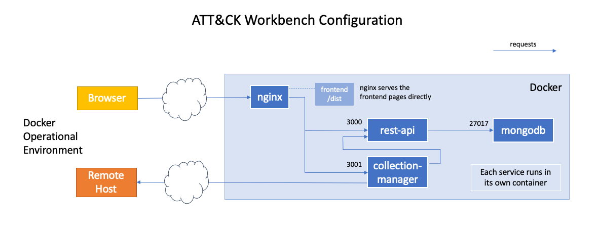

# Docker Compose Installation

This document describes how to install the ATT&CK Workbench components using Docker Compose.

## Project Structure

This project (ATT&CK Workbench Frontend) includes a `docker-compose.yml` file that configures the Docker Compose installation.
In addition to this project, the ATT&CK Workbench REST API and ATT&CH Workbench Collection Manager projects must be pulled from the github repository.
These projects must be placed under a common parent directory:

```
|-- <common parent directory>
    |-- frontend
    |-- rest-api
    |-- collection-manager
```

## Install Process

1. Navigate to the `frontend` directory (containing the `docker-compose.yml` file)
2. Run the command:
```shell
docker-compose up
```

This command will build all of the necessary Docker images and run the corresponding Docker containers.

### Containers

When deployed using Docker Compose, an ATT&CK Workbench installation will include four containers:
* frontend
* rest-api
* collection-manager
* mongodb

These containers will communicate as illustrated in the diagram below.
The `nginx` instance (part of the `frontend` container) is responsible for serving the statically built code for the ATT&CK Workbench web application.
It also acts as a reverse proxy for the `rest-api` and `collection-manager` services.



Note that the `docker-compose.yml` file exposes the ATT&CK Workbench web application on port 80.
The `nginx` configuration file (`nginx/nginx.conf`) can be modified to use HTTPS and port 443, depending on your operational requirements.
